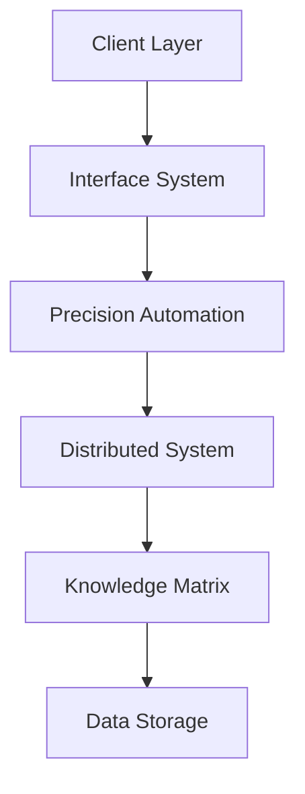

# TerraLegislativePulse Architecture

## System Overview

TerraLegislativePulse is an enterprise-grade civil infrastructure management system that combines:

- Tesla-inspired precision automation
- Jobs-inspired elegant interfaces
- Musk-inspired distributed processing
- Annunaki-tier knowledge matrix

## Core Components

### 1. Precision Automation System
- Asynchronous task management
- Real-time system monitoring
- Fault tolerance and recovery
- Component validation

### 2. Elegant Interface System
- Multi-interface support (Web, API, CLI, Mobile)
- Consistent theming and UX
- Middleware pipeline
- Error handling

### 3. Distributed Processing System
- Node management and monitoring
- Task distribution
- Load balancing
- Fault tolerance

### 4. Knowledge Matrix System
- Graph-based knowledge representation
- Pattern recognition
- Relationship mapping
- Knowledge querying

## System Architecture

## Data Flow

1. **Input Processing**
   - Request validation
   - Authentication/Authorization
   - Rate limiting
   - Input sanitization

2. **Task Distribution**
   - Load balancing
   - Priority queuing
   - Node selection
   - Task monitoring

3. **Knowledge Processing**
   - Pattern recognition
   - Relationship analysis
   - Data validation
   - Knowledge extraction

4. **Response Generation**
   - Data aggregation
   - Format transformation
   - Response validation
   - Delivery confirmation

## Security Architecture

1. **Authentication**
   - JWT-based authentication
   - OAuth2 integration
   - Multi-factor authentication
   - Session management

2. **Authorization**
   - Role-based access control
   - Resource-level permissions
   - Audit logging
   - Access monitoring

3. **Data Protection**
   - End-to-end encryption
   - Data masking
   - Secure storage
   - Backup and recovery

## Scalability

1. **Horizontal Scaling**
   - Node auto-scaling
   - Load distribution
   - State management
   - Cache coordination

2. **Vertical Scaling**
   - Resource optimization
   - Performance tuning
   - Memory management
   - CPU utilization

## Monitoring and Observability

1. **Metrics Collection**
   - System metrics
   - Business metrics
   - User metrics
   - Performance metrics

2. **Logging**
   - Application logs
   - Access logs
   - Error logs
   - Audit logs

3. **Alerting**
   - Threshold-based alerts
   - Anomaly detection
   - Incident management
   - Response automation

## Deployment Architecture

1. **Infrastructure**
   - Kubernetes clusters
   - Load balancers
   - CDN integration
   - Database clusters

2. **CI/CD Pipeline**
   - Automated testing
   - Security scanning
   - Performance testing
   - Deployment automation

3. **Disaster Recovery**
   - Backup strategies
   - Recovery procedures
   - Failover systems
   - Data replication

## Performance Optimization

1. **Caching Strategy**
   - Multi-level caching
   - Cache invalidation
   - Cache warming
   - Cache monitoring

2. **Database Optimization**
   - Query optimization
   - Index management
   - Connection pooling
   - Data partitioning

3. **Network Optimization**
   - CDN utilization
   - Load balancing
   - Connection pooling
   - Protocol optimization 